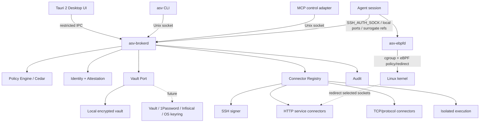

# Architecture

## 1. Logical architecture



## 2. Process architecture

### `asv-brokerd`

Runs under a dedicated service identity, e.g. `_asv`.

Responsibilities:

- vault unlock/use,
- credential decryption,
- policy evaluation,
- connector execution,
- approval orchestration,
- session/capability state,
- audit emission.

Must not load arbitrary plugins into-process in v1. Extensibility begins as versioned built-in connectors or separately sandboxed connector processes.

### `asv-desktop`

Tauri 2 application running as the logged-in human.

Responsibilities:

- credential metadata management,
- policy UX,
- approvals,
- session/audit visualization,
- secure ingestion orchestration.

It is **not** the vault daemon.

### `asv`

Unprivileged CLI.

Responsibilities:

- `run` launcher,
- session/control operations,
- diagnostics,
- shell initialization,
- requests that never return a secret.

### `asv-ebpfd`

Optional privileged Linux helper.

Responsibilities only:

- create/manage protected session cgroups,
- load/attach approved precompiled eBPF programs,
- maintain allow/redirect maps,
- return process/network evidence,
- detach/cleanup.

It has no vault access and no plaintext credential API.

### `asv-worker`

Short-lived process used only for compatibility operations requiring a secret in a child process.

Runs under an isolated identity/namespaces/policy profile and is not a descendant controllable by the agent.

## 3. Rust workspace

```text
crates/
├── domain
├── application
├── ipc-protocol
├── broker
├── vault-api
├── vault-local
├── crypto
├── policy-api
├── policy-cedar
├── identity
├── session
├── audit
├── connector-api
├── connector-ssh-agent
├── connector-http
├── connector-postgres
├── connector-github
├── connector-aws
├── connector-kubernetes
├── compatibility-exec
├── platform-api
├── platform-linux
├── ebpf-common
├── ebpf-programs
├── ebpf-controller
├── cli
└── mcp-adapter

apps/
├── brokerd
├── ebpfd
└── desktop-tauri
```

## 4. Domain model

```rust
struct CredentialId(Uuid);
struct AgentSessionId(Uuid);
struct CapabilityId(Uuid);

struct Credential {
    id: CredentialId,
    label: String,
    kind: CredentialKind,
    exportability: Exportability,
    provider: ProviderRef,
    tags: BTreeSet<String>,
}

enum Exportability {
    NonExportable,
    HumanOnly,
    Exportable,
}

struct AgentSession {
    id: AgentSessionId,
    user: UserIdentity,
    workload: WorkloadIdentity,
    workspace: WorkspaceIdentity,
    security_profile: SecurityProfile,
}

struct Capability {
    id: CapabilityId,
    session: AgentSessionId,
    action: Action,
    resource: Resource,
    audience: Option<Audience>,
    expiry: Instant,
    max_uses: Option<u32>,
}
```

Secret bytes do not belong in serializable DTOs used by generic IPC.

## 5. Ports and adapters

### Vault port

```rust
trait Vault {
    async fn put(&self, metadata: CredentialMetadata, secret: SecretInput) -> Result<CredentialId>;
    async fn with_secret<T>(&self, id: &CredentialId, op: impl SecretOperation<T>) -> Result<T>;
    async fn delete(&self, id: &CredentialId) -> Result<()>;
}
```

Prefer scoped `with_secret`/procedure semantics over `load() -> Vec<u8>` in application code.

### Connector port

```rust
trait Connector {
    fn kind(&self) -> ConnectorKind;
    async fn execute(&self, ctx: AuthorizedContext, op: Operation) -> Result<OperationResult>;
}
```

A connector receives an already-authorized context and obtains secret access through a narrow broker capability.

### Platform enforcement port

```rust
trait SessionEnforcer {
    async fn create(&self, session: &SessionSpec) -> Result<EnforcedSession>;
    async fn update_network_policy(&self, session: &AgentSessionId, p: NetworkPolicy) -> Result<()>;
    async fn terminate(&self, session: &AgentSessionId) -> Result<()>;
}
```

Linux eBPF is one implementation, never a domain dependency.

## 6. IPC

### Broker IPC

Unix-domain `SOCK_SEQPACKET` or framed `SOCK_STREAM` with:

- restrictive filesystem permissions,
- `SO_PEERCRED` validation,
- protocol version negotiation,
- bounded message sizes,
- no generic deserialization of arbitrary type tags,
- request IDs,
- timeout/cancellation,
- explicit method allowlist.

A CBOR/postcard/protobuf encoding is acceptable. Choose one after fuzzing ergonomics; security does not depend on obscurity of the wire format.

### Identity binding

At connect time broker obtains peer PID/UID/GID using kernel-provided Unix socket credentials. It may then open a `pidfd` to avoid PID-reuse races while gathering workload evidence.

Evidence may include:

- UID/GID,
- pidfd identity,
- `/proc/<pid>/exe`,
- cgroup membership,
- parent ancestry snapshot,
- workspace launch record,
- executable digest if required by policy,
- optional SELinux/AppArmor security context.

## 7. Data plane vs control plane

### Control plane

- UI
- CLI policy/session commands
- MCP
- approvals
- audit querying

### Data plane

- SSH agent protocol
- local service proxy ports
- transparent bridge
- protocol connectors
- isolated workers

This separation prevents MCP from becoming a throughput/compatibility bottleneck.

## 8. Security profiles

```text
PORTABLE
  encrypted vault + broker + UDS identity + policy + connectors

LINUX_HARDENED
  + dedicated UID + ptrace protections + cgroup + Landlock/seccomp where compatible
  + eBPF egress/exec telemetry

LINUX_TRANSPARENT
  + socket redirection into broker/proxy
  + optional session-scoped TLS interception for configured destinations

TPM_BOUND
  + vault key sealing / hardware-backed identities
```
