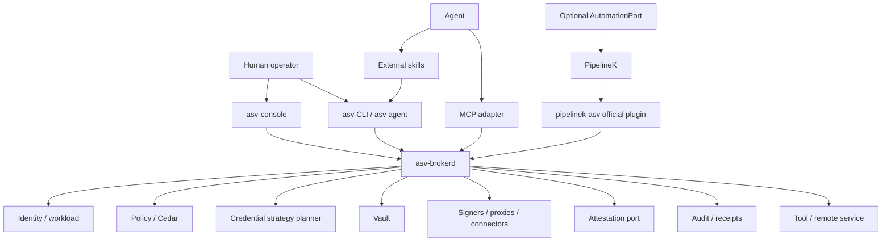

# Arquitectura evolutiva

## 1. Arquitectura lógica



## 2. Regla de dependencia

```text
domain
  <- application
      <- adapters

PipelineK / Keylime / Trustee / SPIFFE / TDX / MCP
son adapters o integraciones.
No aparecen como conceptos obligatorios del dominio.
```

## 3. Nuevos puertos propuestos

### CredentialStrategyPlanner

```rust
trait CredentialStrategyPlanner {
    async fn plan(
        &self,
        intent: &ActionIntent,
        context: &SecurityContext,
    ) -> Result<CredentialUsePlan>;
}
```

### WorkloadIdentityProvider

```rust
trait WorkloadIdentityProvider {
    async fn identity(
        &self,
        process: ProcessIdentity,
    ) -> Result<WorkloadIdentity>;
}
```

### AttestationPort

```rust
trait AttestationPort {
    async fn evaluate(
        &self,
        subject: WorkloadIdentity,
    ) -> Result<AttestationVerdict>;
}
```

### AutomationPort

Vive en control plane/application, **no en broker core** si no es necesario.

```rust
trait AutomationPort {
    async fn start(
        &self,
        workflow: WorkflowIntent,
    ) -> Result<AutomationRunRef>;
}
```

Adapters:

```text
DirectAutomation
PipelineKAutomation
```

`DirectAutomation` sólo resuelve secuencias triviales y nunca debe crecer hasta convertirse en un workflow engine.

## 4. Nuevos ADTs

### ActionIntent

```rust
struct ActionIntent {
    transaction_id: TransactionId,
    principal: PrincipalIdentity,
    actor: AgentIdentity,
    workload: WorkloadIdentity,
    operation: Operation,
    resource: Resource,
    destination: Option<Authority>,
    tool: Option<ToolIdentity>,
    config_fingerprint: Option<Digest>,
    origin: IntentOrigin,
    expires_at: Instant,
}
```

### CredentialUsePlan

```rust
struct CredentialUsePlan {
    id: PlanId,
    intent_digest: Digest,
    strategy: CredentialStrategy,
    posture: IntegrationPosture,
    approval: ApprovalRequirement,
    constraints: Constraints,
    expires_at: Instant,
}
```

### PreparedUse

```rust
enum PreparedUse {
    SignerEndpoint(SignerEndpointRef),
    ProxyEndpoint(ProxyEndpointRef),
    CredentialHelper(HelperRef),
    EphemeralConfig(ConfigProjectionRef),
    DynamicCredential(ShortLivedCredentialRef),
    FederatedAuthority(FederatedAuthorityRef),
    IsolatedWorker(WorkerRef),
}
```

No hay variante `SecretBytes`.

### AttestationVerdict

```rust
enum AttestationVerdict {
    Trusted {
        evidence_ref: EvidenceRef,
        measured_at: Instant,
        claims: AttestationClaims,
    },
    Untrusted { reason: String },
    Stale,
    Unsupported,
}
```

## 5. Principio de materialización tardía

```text
semantic intent
   ↓
policy
   ↓
strategy
   ↓
prepared use
   ↓
tool adapter
   ↓
materialization sólo si es inevitable
```

Nunca:

```text
load secret bytes
   ↓
decidir después qué hacer
```

## 6. Data plane y control plane

### Data plane

- SSH signer.
- HTTP semantic proxy.
- PostgreSQL proxy.
- mTLS signer.
- dynamic credential issuer.
- surrogate redemption.
- compatibility worker.

### Control plane

- enrolment;
- policy;
- approvals;
- integration discovery/adoption;
- rotation;
- workflows;
- audit querying;
- posture/doctor.

PipelineK pertenece al segundo grupo.

## 7. Reglas de TCB

- `asv-brokerd` no carga PipelineK.
- `asv-brokerd` no ejecuta scripts de workflow.
- Connector no confiable no se carga in-process.
- La GUI no se convierte en vault daemon.
- Skills/prompts nunca entran en el broker.
- Automatización opera con refs, IDs y receipts; no con secretos.

## 8. Evolución de seguridad local

Perfiles:

```text
PORTABLE
LINUX_HARDENED
TPM_BOUND
ATTESTED
CONFIDENTIAL_WORKER
```

No todos deben estar disponibles en todas las máquinas.

El producto debe detectar capacidad real y reportarla, no inferir garantía por versión de kernel/CPU.
